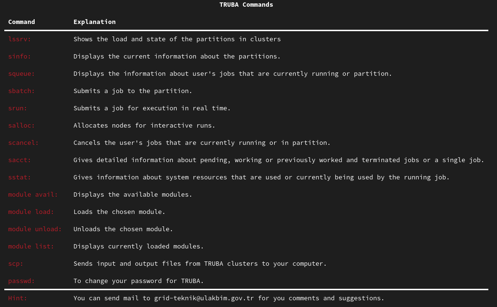

# TRUBA-Commands

Displays TRUBA commands and their explanations.

## 

### Installation Steps
1. With `mkdir -p /etc/lscmd` command create a folder and put `commands.json` in there.  Change the owner to `root:root` and permissions permissions to `755 (drwxr-xr-x)`.
2. Copy `lscmd.mo` file in `/src/locales/en/LC_MESSAGES` to `/usr/local/share/locale/en/LC_MESSAGES`. Change the owner to `root:root` and permissions permissions to `755 (drwxr-xr-x)`.
3. Copy `lscmd.mo` file in `/src/locales/tr/LC_MESSAGES` to `/usr/local/share/locale/tr/LC_MESSAGES`. Change the owner to `root:root` and permissions permissions to `755 (drwxr-xr-x)`.
